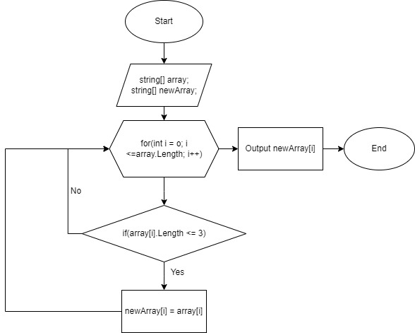

# Ход работы:

1. Обьявляем строчный массив из n-го количества элементов;
2. Объявляем новый строчный массив для записи результатов;
3. Объявление цикла for; 
4. В цикле for проверяем условие (if <= 3 ); 
5. Если условие верное записываем значение во втором массиве. Если нет, переходим к проверке следующего элемента;
6. Выводим результат записи на экран.

